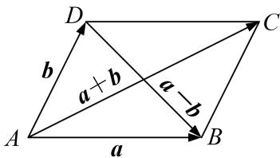
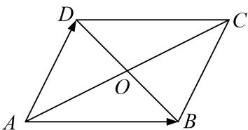

# 专题八 平面向量的极化恒等式

利用向量的极化恒等式可以快速对共起点(终点)的两向量的数量积问题数量积进行转化，体现了向量的几何属性，让“秒杀”向量数量积问题成为一种可能，此恒等式的精妙之处在于建立了向量的数量积与几何长度(数量)之间的桥梁，实现向量与几何、代数的巧妙结合。对于不共起点和不共终点的问题可通过平移转化法等价转化为对共起点(终点)的两向量的数量积问题，从而用极化恒等式解决。

1. 极化恒等式： $a \cdot b = \frac{1}{4} [(a + b)^2 - (a - b)^2]$

几何意义：向量的数量积可以表示为以这组向量为邻边的平行四边形的“和对角线”与“差对角线”平方差的 $\frac{1}{4}$ .

2. 平行四边形模式：如图(1)，平行四边形 ABCD，O 是对角线交点．则：(1) $\overrightarrow{AB}\cdot\overrightarrow{AD}=\frac{1}{4}[|AC|^{2}-|BD|^{2}]$ .

图(1)

图(2)

3. 三角形模式: 如图(2), 在 $\triangle ABC$ 中, 设 $D$ 为 $BC$ 的中点, 则 $\overrightarrow{AB} \cdot \overrightarrow{AC} = |AD|^2 - |BD|^2$ . 三角形模式是平面向量极化恒等式的终极模式, 几乎所有的问题都是用它解决. 记忆: 向量的数量积等于第三边的中线长与第三边长的一半的平方差.

![[高中/总复习/专题/平面向量/专题8 平面向量的极化恒等式-平面向量/考点一_平面向量数量积的定值问题/考点一_平面向量数量积的定值问题.md]]
![[高中/总复习/专题/平面向量/专题8 平面向量的极化恒等式-平面向量/考点二_平面向量数量积的最值_范围_问题/考点二_平面向量数量积的最值_范围_问题.md]]
