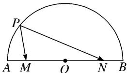

<!-- question-source:start -->
(3)如图所示，AB 是圆 O 的直径，P 是 $\widehat{AB}$ 上的点，M，N 是直径 AB 上关于点 O 对称的两点，且 AB = 6，MN = 4，则 $\overrightarrow{PM} \cdot \overrightarrow{PN} = (\quad)$

A. 13 B. 7 C. 5 D. 3
<!-- question-source:end -->

![[高中/总复习/专题/平面向量/专题8 平面向量的极化恒等式-平面向量/考点01_平面向量数量积的定值问题/例题/answers/Q00045388A1.md]]
