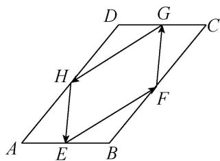

<!-- question-source:start -->
(4)如图，在平行四边形ABCD中， $AB = 1$ ， $AD = 2$ ，点 $E$ ， $F$ ， $G$ ， $H$ 分别是 $AB$ ， $BC$ ， $CD$ ， $AD$ 边上的中点，则 $\overrightarrow{EF}\cdot \overrightarrow{FG} +\overrightarrow{GH}\cdot \overrightarrow{HE} =$ \_\_\_\_.

<!-- question-source:end -->

![[高中/总复习/专题/平面向量/专题8 平面向量的极化恒等式-平面向量/考点01_平面向量数量积的定值问题/例题/answers/Q00045389A1.md]]
