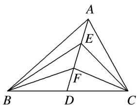

<!-- question-source:start -->
(5) (2016·江苏)如图, 在 $\triangle ABC$ 中, $D$ 是 $BC$ 的中点, $E, F$ 是 $AD$ 上的两个三等分点. $\overrightarrow{BA} \cdot \overrightarrow{CA} = 4$ , $\overrightarrow{BF} \cdot \overrightarrow{CF} = -1$ , 则 $\overrightarrow{BE} \cdot \overrightarrow{CE}$ 的值为 \_\_\_\_.

<!-- question-source:end -->

![[高中/总复习/专题/平面向量/专题8 平面向量的极化恒等式-平面向量/考点01_平面向量数量积的定值问题/例题/answers/Q00045390A1.md]]
