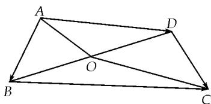

<!-- question-source:start -->
3. 如图, 在平面四边形 $ABCD$ 中, $O$ 为 $BD$ 的中点, 且 $OA = 3$ , $OC = 5$ , 若 $\overrightarrow{AB} \cdot \overrightarrow{AD} = -7$ , 则 $\overrightarrow{BC} \cdot \overrightarrow{DC}$ 的值是 \_\_\_\_.

<!-- question-source:end -->

![[高中/总复习/专题/平面向量/专题8 平面向量的极化恒等式-平面向量/考点01_平面向量数量积的定值问题/对点训练/answers/Q00045394A1.md]]
