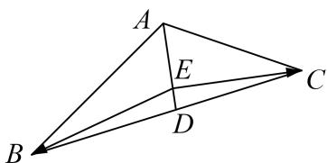

> [!faq]- 《专题8 平面向量的极化恒等式-平面向量》例题解析
>
> > [!success]- **【答案】** 详见解析
>
> > [!note]- **【解析】**
> > 答案 $-\frac{27}{7}$ 解析 由余弦定理得， $BC^{2}=AB^{2}+AC^{2}-2AB\cdot AC\cdot\cos120^{\circ}=19$ ，即 $BC=\sqrt{19}$ ，因为 $\overrightarrow{AB}\cdot\overrightarrow{AC}$ $AD^{2}-CD^{2}=|AB|\cdot|AC|\cdot\cos120^{\circ}=-3$ ，所以 $|AD|=\frac{\sqrt{7}}{2}$ ，因为 $S_{\triangle ABC}=2S_{\triangle ADC}$ ，则 $\frac{1}{2}|AB|\cdot|AC|\cdot\sin120^{\circ}=2\cdot\frac{1}{2}|AD||CE|$ ，解得 $|CE|=\frac{3\sqrt{21}}{7}$ ，在 Rt△DEC 中， $|DE|=\sqrt{CD^{2}-CE^{2}}=\frac{5\sqrt{7}}{14}$ ，所以 $\overrightarrow{EB}\cdot\overrightarrow{EC}=|ED|^{2}-|CD|^{2}=-\frac{27}{7}$ .
> >
> > 
