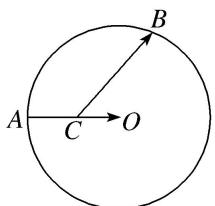

<!-- question-source:start -->
2. 如图, 设 $A$ , $B$ 是半径为 2 的圆 $O$ 上的两个动点, 点 $C$ 为 $AO$ 中点, 则 $\overrightarrow{CO} \cdot \overrightarrow{CB}$ 的取值范围是 ( )

A. $[-1, 3]$ B. $[1, 3]$ C. $[-3, -1]$ D. $[-3, 1]$
<!-- question-source:end -->

![[高中/总复习/专题/平面向量/专题8 平面向量的极化恒等式-平面向量/考点02_平面向量数量积的最值_范围_问题/对点训练/answers/Q00045409A1.md]]
