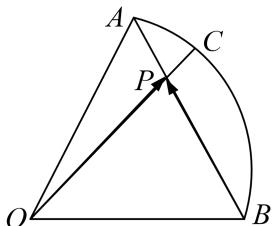

<!-- question-source:start -->
3. 如图，在半径为 1 的扇形 $AOB$ 中， $\angle AOB = \frac{\pi}{3}$ ， $C$ 为弧上的动点， $AB$ 与 $OC$ 交于点 $P$ ，则 $\overrightarrow{OP} \cdot \overrightarrow{BP}$ 的最小值为 \_\_\_\_.

<!-- question-source:end -->

![[高中/总复习/专题/平面向量/专题8 平面向量的极化恒等式-平面向量/考点02_平面向量数量积的最值_范围_问题/对点训练/answers/Q00045410A1.md]]
