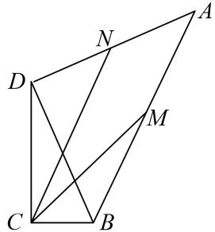

<!-- question-source:start -->
17. 如图，已知 B, D 是直角 C 两边上的动点， $AD \perp BD$ ， $|\overrightarrow{AD}| = \sqrt{3}$ ， $\angle BAD = \frac{\pi}{6}$ ， $\overrightarrow{CM} = \frac{1}{2} (\overrightarrow{CA} + \overrightarrow{CB})$ ， $\overrightarrow{CN} =$

$\frac{1}{2}(\overrightarrow{CD}+\overrightarrow{CA})$ ，则 $\overrightarrow{CM}\cdot\overrightarrow{CN}$ 的最大值为\_\_\_\_.

<!-- question-source:end -->

![[高中/总复习/专题/平面向量/专题8 平面向量的极化恒等式-平面向量/考点02_平面向量数量积的最值_范围_问题/对点训练/answers/Q00045424A1.md]]
