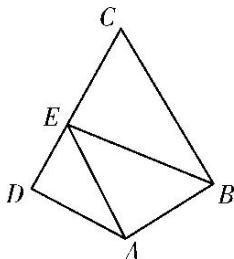

<!-- question-source:start -->
19. (2018·天津)如图, 在平面四边形 $ABCD$ 中, $AB \perp BC$ , $AD \perp CD$ , $\angle BAD = 120^{\circ}$ , $AB = AD = 1$ . 若点 $E$ 为边 $CD$ 上的动点, 则 $\overrightarrow{AE} \cdot \overrightarrow{BE}$ 的最小值为 \_\_\_\_.

<!-- question-source:end -->

![[高中/总复习/专题/平面向量/专题8 平面向量的极化恒等式-平面向量/考点02_平面向量数量积的最值_范围_问题/对点训练/answers/Q00045426A1.md]]
