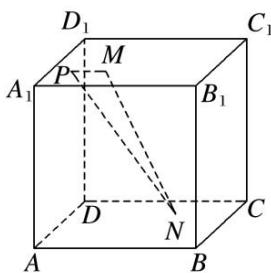

<!-- question-source:start -->
22. 如图所示, 正方体 $ABCD-A_{1}B_{1}C_{1}D_{1}$ 的棱长为 2 , $MN$ 是它的内切球的一条弦(我们把球面上任意两点之间的线段称为球的弦), $P$ 为正方体表面上的动点, 当弦 $MN$ 的长度最大时, $\overrightarrow{PM} \cdot \overrightarrow{PN}$ 的取值范围是 \_\_\_\_.

<!-- question-source:end -->

![[高中/总复习/专题/平面向量/专题8 平面向量的极化恒等式-平面向量/考点02_平面向量数量积的最值_范围_问题/对点训练/answers/Q00045429A1.md]]
