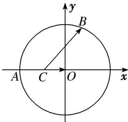

> [!faq]- 《专题8 平面向量的极化恒等式-平面向量》例题解析
>
> > [!success]- **【答案】** A
>
> > [!note]- **【分析】**
> > 本题未单列分析。
>
> > [!note]- **【解析】**
> > 答案 A 解析 建立平面直角坐标系如图所示，可得 $O(0, 0)$ ， $A(-2, 0)$ ， $C(-1, 0)$ ，设 $B(2\cos\theta, 2\sin\theta)$ 。 $\theta \in [0, 2\pi)$ 。则 $\overrightarrow{CO} \cdot \overrightarrow{CB} = (1, 0) \cdot (2\cos\theta + 1, 2\sin\theta) = 2\cos\theta + 1 \in [-1, 3]$ 。故选 A.
> >
> > 
> >
> > 极化恒等式法 连接 OB，取 OB 的中 D，连接 CD，则 $\overrightarrow{CO}\cdot\overrightarrow{CB}=|CD|^{2}-|BD|^{2}=CD^{2}-1$ ，又 $|CD|_{\min}^{2}=0$ ，∴ $\overrightarrow{CO}\cdot\overrightarrow{CB}$ 的最小值为 -1。 $|CD|_{\max}^{2}=2$ ，∴ $\overrightarrow{CO}\cdot\overrightarrow{CB}$ 的最大值为 3。
