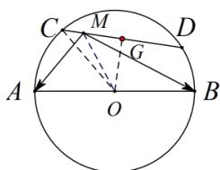

> [!faq]- 《专题8 平面向量的极化恒等式-平面向量》例题解析
>
> > [!success]- **【答案】** 详见解析
>
> > [!note]- **【分析】**
> > 本题未单列分析。
>
> > [!note]- **【解析】**
> > 答案 $[-9, 0]$ 解析 如图， $\overrightarrow{MA} \cdot \overrightarrow{MB} = \overrightarrow{MO}^2 - \overrightarrow{AO}^2 = \overrightarrow{MO}^2 - 16$ ， $\because |\overrightarrow{OG}| \leq |\overrightarrow{OM}| \leq |\overrightarrow{OC}|$ ， $\therefore \sqrt{7} \leq |\overrightarrow{OM}| \leq 4$ ， $\therefore \overrightarrow{MA} \cdot \overrightarrow{MB}$ 的取值范围是 $[-9, 0]$ .
> >
> > 
