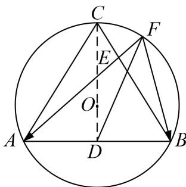

> [!faq]- 《专题8 平面向量的极化恒等式-平面向量》例题解析
>
> > [!success]- **【答案】** 详见解析
>
> > [!note]- **【解析】**
> > 答案 [0, 6] 解析 取 $AB$ 的中点 $D$ , 连接 $CD$ , 因为三角形 $ABC$ 为正三角形, 所以 $O$ 为三角形 $ABC$ 的重心, $O$ 在 $CD$ 上, 且 $OC = 2OD = 2$ , 所以 $CD = 3$ , $AB = 2\sqrt{3}$ . 又由极化恒等式得: $\overrightarrow{FA} \cdot \overrightarrow{FB} = |FD|^2 - |AD|^2 = |FD|^2 - 3$ , 因为 $F$ 在劣弧 $BC$ 上, 所以当 $F$ 在点 $C$ 处时, $|FD|_{\max} = 3$ , 当 $F$ 在点 $B$ 处时, $|PD|_{\min} = \sqrt{3}$ , 所以 $\overrightarrow{PA} \cdot \overrightarrow{PB} \in [0, 6]$ .
> >
> > 
