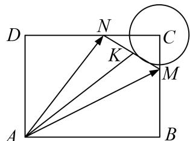

> [!faq]- 《专题8 平面向量的极化恒等式-平面向量》例题解析
>
> > [!success]- **【答案】** 详见解析
>
> > [!note]- **【分析】**
> > 本题未单列分析。
>
> > [!note]- **【解析】**
> > 答案 15 解析 取 K 为 MN 中点，由极化恒等式， $\overrightarrow{AM}\cdot\overrightarrow{AN}=|AK|^{2}-1$ ，显然 K 的轨迹是以点 C 为圆心，1 为半径的圆周在矩形内部的圆弧，所以 $|AK|_{min}=5-1=4$ ，所以 $\overrightarrow{AM}\cdot\overrightarrow{AN}$ 的最小值为 15.
> > 
