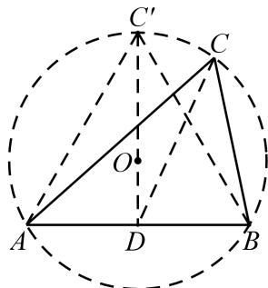

> [!faq]- 《专题8 平面向量的极化恒等式-平面向量》例题解析
>
> > [!success]- **【答案】** 详见解析
>
> > [!note]- **【分析】**
> > 本题未单列分析。
>
> > [!note]- **【解析】**
> > 答案 $\frac{3}{2}$ 解析 设 $D$ 是 $AB$ 的中点，连接 $CD$ ，点 $O$ 是 $\triangle ABC$ 的外心，连接 $DO$ 并延长交圆 $O$ 于 $C'$ ，由 $\triangle ABC'$ 是等边三角形， $\because AD = \frac{\sqrt{3}}{2}, \therefore C'D = \frac{3}{2}$ ，则 $\overrightarrow{CA} \cdot \overrightarrow{CB} = |\overrightarrow{CD}|^2 - |\overrightarrow{DA}|^2 = |\overrightarrow{CD}|^2 - (\frac{\sqrt{3}}{2})^2 \leq |\overrightarrow{C'}D|^2 - \frac{3}{4} = (\frac{3}{2})^2 - \frac{3}{4} = \frac{3}{2}$ . $\therefore (\overrightarrow{CA} \cdot \overrightarrow{CB})_{max} = \frac{3}{2}$ .
> > 
