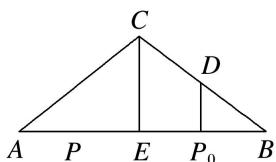

> [!faq]- 《专题8 平面向量的极化恒等式-平面向量》例题解析
>
> > [!success]- **【答案】** D
>
> > [!note]- **【解析】**
> > 答案 D 解析 如图所示，取 AB 的中点 E，因为 $P_{0}B=\frac{1}{4}AB$ ，所以 $P_{0}$ 为 EB 的中点，取 BC 的中点 D，则 $DP_{0}$ 为 $\triangle CEB$ 的中位线， $DP_{0} \parallel CE$ .
> >
> > 
> >
> > 根据向量的极化恒等式，有 $\vec{PB} \cdot \vec{PC} = \vec{PD}^2 - \vec{DB}^2$ ， $\vec{P_0B} \cdot \vec{P_0C} = \vec{P_0D}^2 - \vec{DB}^2$ 。又 $\vec{PB} \cdot \vec{PC} \geqslant \vec{P_0B} \cdot \vec{P_0C}$ ，则 $|\vec{PD}| \geqslant |\vec{P_0D}|$ 恒成立，必有 $DP_0 \perp AB$ 。因此 $CE \perp AB$ ，又 $E$ 为 $AB$ 的中点，所以 $AC = BC$ 。
