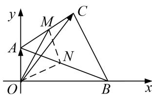

> [!faq]- 《专题8 平面向量的极化恒等式-平面向量》例题解析
>
> > [!success]- **【答案】** 详见解析
>
> > [!note]- **【分析】**
> > 本题未单列分析。
>
> > [!note]- **【解析】**
> > 答案 18 解析 如图取 AC 的中点 M，取 AB 的中点 N，则 $\overrightarrow{OA} \cdot \overrightarrow{OC} = \overrightarrow{OM}^{2} - \overrightarrow{AM}^{2} = \overrightarrow{OM}^{2} - (\frac{3}{2})^{2} \leqslant (\overrightarrow{ON}^{2} - \overrightarrow{NM}^{2}) - (\frac{3}{2})^{2} = (2 + \frac{5}{2})^{2} - (\frac{3}{2})^{2} = 18$ .
> > 
