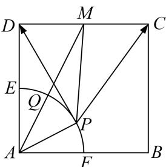

> [!faq]- 《专题8 平面向量的极化恒等式-平面向量》例题解析
>
> > [!success]- **【答案】** 详见解析
>
> > [!note]- **【分析】**
> > 本题未单列分析。
>
> > [!note]- **【解析】**
> > 答案 $5 - 2\sqrt{5}$ 解析 如图取 $CD$ 的中点 $M$ ， $\overrightarrow{PC} \cdot \overrightarrow{PD} = PM^2 - DM^2 = PM^2 - 1$ ，而 $|PM| + 1 = |PM| + |AP| \geq |AM| = \sqrt{5}$ ，当且仅当 $P$ ， $Q$ 重合时等号成立，所以 $\overrightarrow{PC} \cdot \overrightarrow{PD}$ 的最小值为 $(\sqrt{5} - 1)^2 - 1 = 5 - 2\sqrt{5}$ .
> >
> > 
