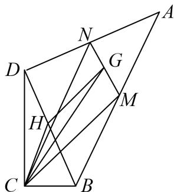

> [!faq]- 《专题8 平面向量的极化恒等式-平面向量》例题解析
>
> > [!success]- **【答案】** 详见解析
>
> > [!note]- **【分析】**
> > 本题未单列分析。
>
> > [!note]- **【解析】**
> > 答案 $\frac{\sqrt{13} + 4}{4}$ 解析 设 $MN$ 的中点为 $G$ , $BD$ 的中点为 $H$ , $\overrightarrow{CM} \cdot \overrightarrow{CN} = |\overrightarrow{CG}|^2 - |\overrightarrow{GN}|^2 = |\overrightarrow{CG}|^2 - \frac{1}{16}$ , $\because |\overrightarrow{CG}| \leq |\overrightarrow{CH}| + |\overrightarrow{HG}| = \frac{1}{2} + \frac{\sqrt{13}}{4}, \therefore \overrightarrow{CM} \cdot \overrightarrow{CN} \leq (\frac{1}{2} + \frac{\sqrt{13}}{4})^2 - \frac{1}{16} = \frac{\sqrt{13} + 4}{4}$ . 所以 $\overrightarrow{CM} \cdot \overrightarrow{CN}$ 的最大值为 $\frac{\sqrt{13} + 4}{4}$ .
> > 
