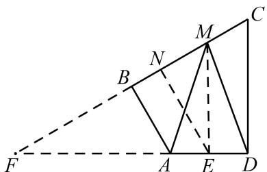
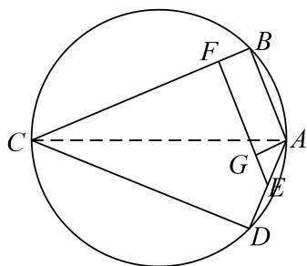

> [!faq]- 《专题8 平面向量的极化恒等式-平面向量》例题解析
>
> > [!success]- **【答案】** 详见解析
>
> > [!note]- **【分析】**
> > 本题未单列分析。
>
> > [!note]- **【解析】**
> > 答案 $\frac{21}{4}$ 解析 设 $E$ 是 $AD$ 的中点，作 $EN \perp BC$ 于 $N$ ，延长 $CB$ 交 $DA$ 的延长线于 $F$ ，由题意可得： $FD = \sqrt{3} CD = 6, FC = 2CD = 4\sqrt{3}, \therefore BF = 2\sqrt{3}, \therefore AB = 2, FA = 4, \therefore AD = 2, \frac{EN}{AB} = \frac{EF}{FA} = \frac{5}{4}, EN = \frac{5}{2}.$ 则 $\overrightarrow{AM} \cdot \overrightarrow{DM} = \overrightarrow{MA} \cdot \overrightarrow{MD} = |\overrightarrow{ME}|^2 - |\overrightarrow{EA}|^2 = |\overrightarrow{ME}|^2 - 1 \geq EN^2 - 1 = (\frac{5}{2})^2 - 1 = \frac{21}{4}.$ $\therefore \overrightarrow{AM} \cdot \overrightarrow{DM} = \frac{21}{4}.$
> > 
> > 另解 设 E 是 AD 的中点，作 $EF \perp BC$ 于 F，作 $AG \perp EF$ 于 G，∵ $AB \perp BC, AD \perp CD, \therefore$ 四边形 ABCD 共圆，如图，由圆的对称性及 $\angle BCD = 60^{\circ}, CB = CD = 2\sqrt{3}$ ，可知 $\angle BCA = \angle DCA = 30^{\circ}, \therefore AB = 2, \because \angle GAE = 30^{\circ}, \therefore GE = \frac{1}{2}, \therefore EF = 2 + \frac{1}{2} = \frac{5}{2}$ ，则 $\overrightarrow{AM} \cdot \overrightarrow{DM} = \overrightarrow{MA} \cdot \overrightarrow{MD} = |\overrightarrow{ME}|^{2} - |\overrightarrow{EA}|^{2} = |\overrightarrow{ME}|^{2} - 1 \geq EN^{2} - 1 =$
> > $$
> > (\frac {5}{2}) ^ {2} - 1 = \frac {2 1}{4}. \therefore \overrightarrow {A M} \cdot \overrightarrow {D M} = \frac {2 1}{4}.
> > $$
> > 
