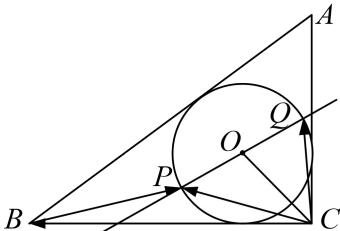

> [!faq]- 《专题8 平面向量的极化恒等式-平面向量》例题解析
>
> > [!success]- **【答案】** 详见解析
>
> > [!note]- **【解析】**
> > 答案 $[-7, 1]$ 解析 易知，圆的半径为 1， $\overrightarrow{BP} \cdot \overrightarrow{CQ} = (\overrightarrow{BC} + \overrightarrow{CP}) \cdot \overrightarrow{CQ} = \overrightarrow{BC} \cdot \overrightarrow{CQ} + \overrightarrow{CP} \cdot \overrightarrow{CQ} = \overrightarrow{CP} \cdot \overrightarrow{CQ} - \overrightarrow{CB} \cdot \overrightarrow{CQ}$ ， $\overrightarrow{CP} \cdot \overrightarrow{CQ} = \overrightarrow{CQ}^{2} - \overrightarrow{OP}^{2} = 2 - 1 = 1$ 。 $\overrightarrow{CB} \cdot \overrightarrow{CQ} = |\overrightarrow{CB}| |\overrightarrow{CQ}| \cos \angle BCQ = 2 |\overrightarrow{CQ}| \cos \angle BCQ, (|\overrightarrow{CQ}| \cos \angle BCQ)_{min} = 0, (|\overrightarrow{CQ}| \cos \angle BCQ)_{max} = 4$ 。所以 $\overrightarrow{BP} \cdot \overrightarrow{CQ}$ 的取值范围为 $[-7, 1]$ 。
> >
> > 
