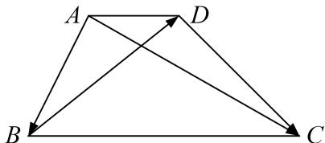

<!-- question-source:start -->
(6)在梯形ABCD中，满足 $AD \parallel BC$ ，AD=1，BC=3， $\overrightarrow{AB} \cdot \overrightarrow{DC} = 2$ ，则 $\overrightarrow{AC} \cdot \overrightarrow{BD}$ 的值为\_\_\_\_。

<!-- question-source:end -->

![[高中/总复习/专题/平面向量/专题8 平面向量的极化恒等式-平面向量/考点一_平面向量数量积的定值问题/例题选讲/例题/answers/Q00033429A1.md]]
