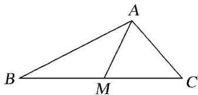

> [!faq]- 教师版例题解析
>
> > [!success]- **【答案】** 详见解析
>
> > [!note]- **【分析】**
> > 本题未单列分析。
>
> > [!note]- **【解析】**
> > 答案 -16 解析 因为 $M$ 是 $BC$ 的中点，由极化恒等式得： $\overrightarrow{AB} \cdot \overrightarrow{AC} = |AM|^2 - \frac{1}{4} |BC|^2 = 9 - \frac{1}{4} \times 100 = -16.$
> > 
