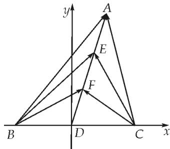

> [!faq]- 教师版例题解析
>
> > [!success]- **【答案】** 详见解析
>
> > [!note]- **【分析】**
> > 本题未单列分析。
>
> > [!note]- **【解析】**
> > 答案 $\frac{7}{8}$ 解析 极化恒等式法 设 $BD = DC = m$ ， $AE = EF = FD = n$ ，则 $AD = 3n$ 。根据向量的极化恒等式，有 $\overrightarrow{AB} \cdot \overrightarrow{AC} = \overrightarrow{AD}^2 - \overrightarrow{DB}^2 = 9n^2 - m^2 = 4$ ， $\overrightarrow{FB} \cdot \overrightarrow{FC} = \overrightarrow{FD}^2 - \overrightarrow{DB}^2 = n^2 - m^2 = -1$ 。联立解得 $n^2 = \frac{5}{8}, m^2 = \frac{13}{8}$ 。因此 $\overrightarrow{EB} \cdot \overrightarrow{EC} = \overrightarrow{ED}^2 - \overrightarrow{DB}^2 = 4n^2 - m^2 = \frac{7}{8}$ 。即 $\overrightarrow{BE} \cdot \overrightarrow{CE} = \frac{7}{8}$
> > 坐标法 以直线 BC 为 x 轴, 过点 D 且垂直于 BC 的直线为 y 轴, 建立如图所示的平面直角坐标系 xoy, 如图: 设 $A(3a, 3b)$ , $B(-c, 0)$ , $C(-c, 0)$ , 则有 $E(2a, 2b)$ , $F(a, b)$ $\overrightarrow{BA} \cdot \overrightarrow{CA} = (3a + c, 3b) \cdot (3a - c, 3b)$
> > $= 9a^{2} - c^{2} + 9b^{2} = 4$ $\overrightarrow{BF}\cdot \overrightarrow{CF} = (a + c, b)\cdot (a - c, b) = a^{2} - c^{2} + b^{2} = -1$ ，则 $a^2 +b^2 = \frac{5}{8}, c^2 = \frac{13}{8}$ $\overrightarrow{BE}\cdot \overrightarrow{CE} = (2a - c, 2b)\cdot (2a - c, 2b) = 4a^2 -c^2 +4b^2 = \frac{7}{8}.$
> > 
> > 基向量 $\overrightarrow{BA}\cdot \overrightarrow{CA} = (\overrightarrow{DA} -\overrightarrow{DB})(\overrightarrow{DA} -\overrightarrow{DC}) = \frac{4\overrightarrow{AD}^2 - \overrightarrow{BC}^2}{4} = \frac{36\overrightarrow{FD}^2 - \overrightarrow{BC}^2}{4} = 4,$ $\overrightarrow{BF}\cdot \overrightarrow{CF} = (\overrightarrow{DF} -\overrightarrow{DB})(\overrightarrow{DF} -\overrightarrow{DC})$ $= \frac{4\overrightarrow{FD}^2 - \overrightarrow{BC}^2}{4} = -1$ ，因此 $\overrightarrow{FD}^2 = \frac{5}{8},\overrightarrow{BC} = \frac{13}{2},\overrightarrow{BE}\cdot \overrightarrow{CE} = (\overrightarrow{DE} -\overrightarrow{DB})(\overrightarrow{DE} -\overrightarrow{DC}) = \frac{4\overrightarrow{ED}^2 - \overrightarrow{BC}^2}{4} = \frac{16\overrightarrow{FD}^2 - \overrightarrow{BC}^2}{4} = \frac{7}{8}.$
