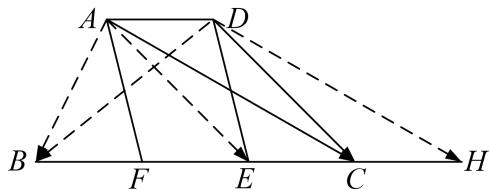

> [!faq]- 教师版例题解析
>
> > [!success]- **【答案】** 详见解析
>
> > [!note]- **【分析】**
> > 本题未单列分析。
>
> > [!note]- **【解析】**
> > 答案 4 解析 过 A 点作 AE 平行于 DC，交 BC 于 E，取 BE 中点 F，连接 AF，过 D 点作 DH 平行于 AC，交 BC 延长线于 H，E 为 BH 中点，连接 DE， $\overrightarrow{AB} \cdot \overrightarrow{DC} = \overrightarrow{AB} \cdot \overrightarrow{AE} = AF^{2} - BF^{2} = AF^{2} - 1 = 2$ ， $\overrightarrow{AC} \cdot \overrightarrow{BD} = -\overrightarrow{DB} \cdot \overrightarrow{DH} = BE^{2} - DE^{2} = 4 - DE^{2}$ ，又 FE = BE - BF = 1，AD // BC，则四边形 ADEF 为平行四边形，AF = DE， $\therefore \overrightarrow{AC} \cdot \overrightarrow{BD} = 1$ 。
> > 
