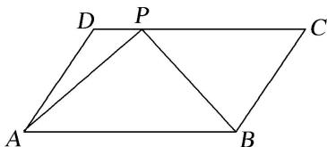

<!-- question-source:start -->
7. 如图，在平行四边形 $ABCD$ 中，已知 $AB = 8, AD = 5, \overrightarrow{CP} = 3\overrightarrow{PD}, \overrightarrow{AP} \cdot \overrightarrow{BP} = 2$ ，则 $\overrightarrow{AB} \cdot \overrightarrow{AD}$ 的值是（）

A. 44 B. 22 C. 24 D. 72

7.
<!-- question-source:end -->

![[高中/总复习/专题/平面向量/专题8 平面向量的极化恒等式-平面向量/考点一_平面向量数量积的定值问题/对点训练/题目/answers/Q00033436A1.md]]
