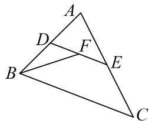

<!-- question-source:start -->
8. 如图，在 $\triangle ABC$ 中，已知 $AB=4$ ， $AC=6$ ， $\angle A=60^{\circ}$ ，点 $D$ ， $E$ 分别在边 $AB$ ， $AC$ 上，且 $\overrightarrow{AB}=2\overrightarrow{AD}$ ， $\overrightarrow{AC}=2\overrightarrow{AE}$ ，若 $F$ 为 $DE$ 的中点，则 $\overrightarrow{BF}\cdot\overrightarrow{DE}$ 的值为\_\_\_\_。

8.
<!-- question-source:end -->

![[高中/总复习/专题/平面向量/专题8 平面向量的极化恒等式-平面向量/考点一_平面向量数量积的定值问题/对点训练/题目/answers/Q00033437A1.md]]
