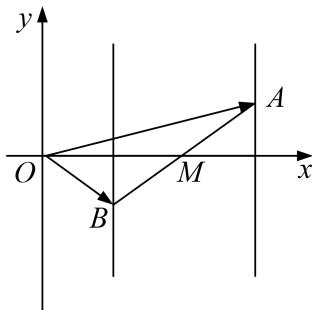

> [!faq]- 教师版对点训练解析
>
> > [!success]- **【答案】** C
>
> > [!note]- **【分析】**
> > 本题未单列分析。
>
> > [!note]- **【解析】**
> > 答案 C 解析 如图，点 A, B 分别在直线 x=1, x=3 上， $|\overrightarrow{AB}|=4$ ，当 $|\overrightarrow{OA}+\overrightarrow{OB}|$ 取最小值时，AB 的中点在 x 轴上， $\overrightarrow{OA}\cdot\overrightarrow{OB}=\overrightarrow{OM}^{2}-\overrightarrow{BM}^{2}=4-4=0$ .
> > 
