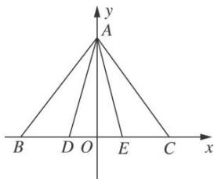

> [!faq]- 教师版对点训练解析
>
> > [!success]- **【答案】** C
>
> > [!note]- **【分析】**
> > 本题未单列分析。
>
> > [!note]- **【解析】**
> > 答案 C 解析 解法一：因为 D, E 是边 BC 的两个三等分点，所以 BD=DE=CE= $\frac{1}{3}$ ，在 $\triangle ABD$ 中， $AD^{2}=BD^{2}+AB^{2}-2BD\cdot AB\cdot\cos60^{\circ}=\left(\frac{1}{3}\right)^{2}+1^{2}-2\times\frac{1}{3}\times1\times\frac{1}{2}=\frac{7}{9}$ ，即 $AD=\frac{\sqrt{7}}{3}$ ，同理可得 $AE=\frac{\sqrt{7}}{3}$ ，在 $\triangle ADE$ 中，由余弦定理得 $\cos\angle DAE=\frac{AD^{2}+AE^{2}-DE^{2}}{2AD\cdot AE}=\frac{\frac{7}{9}+\frac{7}{9}-\left(\frac{1}{3}\right)^{2}}{2\times\frac{\sqrt{7}}{3}\times\frac{\sqrt{7}}{3}}=\frac{13}{14}$ ，所以 $\overrightarrow{AD}\cdot\overrightarrow{AE}=|\overrightarrow{AD}|\cdot|\overrightarrow{AE}|\cos\angle DAE=\frac{\sqrt{7}}{3}\times\frac{\sqrt{7}}{3}\times\frac{13}{14}=\frac{13}{18}$ .
> > 解法二：如图，建立平面直角坐标系，由正三角形的性质易得 $A\left(0, \frac{\sqrt{3}}{2}\right), D\left(-\frac{1}{6}, 0\right), E\left(\frac{1}{6}, 0\right)$ ，所以 $\overrightarrow{AD} = (-\frac{1}{6}, -\frac{\sqrt{3}}{2})$ ， $\overrightarrow{AE} = \left[\frac{1}{6}, -\frac{\sqrt{3}}{2}\right]$ 所以 $\overrightarrow{AD}\cdot \overrightarrow{AE} = \left(-\frac{1}{6}, -\frac{\sqrt{3}}{2}\right)\cdot \left[\frac{1}{6}, -\frac{\sqrt{3}}{2}\right] = -\frac{1}{36} +\frac{3}{4} = \frac{13}{18}.$ 极化恒等式法 取 $DE$ 中点 $F$ ，连接 $AF$ ，则 $\overrightarrow{AD}\cdot \overrightarrow{AE} = |AF|^2 -|DF|^2 = \frac{3}{4} -\frac{1}{36} = \frac{13}{18}.$
> > 
