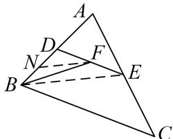

> [!faq]- 教师版对点训练解析
>
> > [!success]- **【答案】** 详见解析
>
> > [!note]- **【分析】**
> > 本题未单列分析。
>
> > [!note]- **【解析】**
> > 答案 4 解析 取 $BD$ 的中点 $N$ , 连接 $NF, EB$ , 则 $BE \perp AE$ , $\therefore BE = 2\sqrt{3}$ . 在 $\triangle DEB$ 中. $FN // \frac{1}{2}EB$ . $\therefore FN = \sqrt{3}$ . $\overrightarrow{BF} \cdot \overrightarrow{DE} = 2\overrightarrow{FB} \cdot \overrightarrow{FD} = 2(FN^2 - DN^2) = 4$ .
> > 
