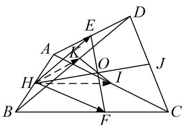
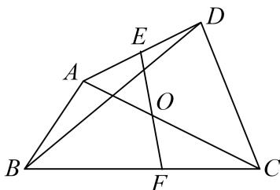

> [!faq]- 教师版对点训练解析
>
> > [!success]- **【答案】** 详见解析
>
> > [!note]- **【分析】**
> > 本题未单列分析。
>
> > [!note]- **【解析】**
> > 答案 解析 极化恒等式 如图，取 $AB, AC, CD, BD$ 中点 $H, I, J, K$ ，四边形 $ABCD$ 中，易知 $EF, KI, HJ$ 三线共点于 $O$ ， $\because \overrightarrow{AD} \cdot \overrightarrow{BC} = 15 \Rightarrow \overrightarrow{HK} \cdot \overrightarrow{HI} = \frac{15}{4} = HO^2 - IO^2$ ，又 $\because \overrightarrow{AC} \cdot \overrightarrow{BD} = 4\overrightarrow{HE} \cdot \overrightarrow{HF} = 4(HO^2 - FO^2)$ ，在 $\Delta EFI$ 中， $\because EF = \sqrt{2}, EI = \frac{\sqrt{5}}{2}, FI = \frac{1}{2}$ ，由中线长公式知 $IO^2 = \frac{1}{4}$ ，从而 $HO^2 = 4$ ， $\overrightarrow{AC} \cdot \overrightarrow{BD} = 4(4 - \frac{1}{2}) = 14$ 。
> > 
> > 基向量法 $\because 2\overrightarrow{EF} = \overrightarrow{AB} +\overrightarrow{DC}$ ， $\therefore 4\overrightarrow{EF}^2 = \overrightarrow{AB}^2 +\overrightarrow{DC}^2 +2\overrightarrow{AB}\cdot \overrightarrow{DC}$ ，又 $AB = 1$ ， $DC = \sqrt{5}$ ， $EF = \sqrt{2}$ $\therefore \overrightarrow{AB} \cdot \overrightarrow{DC} = 1, \because \overrightarrow{AD} \cdot \overrightarrow{BC} = 15, \therefore (\overrightarrow{AC} + \overrightarrow{CD}) \cdot (\overrightarrow{BD} + \overrightarrow{DC}) = 15$ ，则 $\overrightarrow{AC} \cdot \overrightarrow{BD} + \overrightarrow{AC} \cdot \overrightarrow{DC} + \overrightarrow{CD} \cdot \overrightarrow{BD} - \overrightarrow{DC}^2 = 15$ ，可化为 $\overrightarrow{AC} \cdot \overrightarrow{BD} + (\overrightarrow{AB} + \overrightarrow{BC}) \cdot \overrightarrow{DC} + \overrightarrow{CD} \cdot (\overrightarrow{BC} + \overrightarrow{CD}) - 5 = 15, \overrightarrow{AC} \cdot \overrightarrow{BD} + \overrightarrow{AB} \cdot \overrightarrow{DC} = 15,$ 故 $\overrightarrow{AC} \cdot \overrightarrow{BD} = 14.$
> > 
