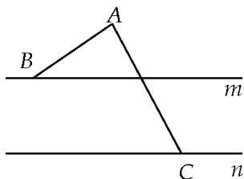

<!-- question-source:start -->
(2)如图，在同一平面内，点 A 位于两平行直线 m，n 的同侧，且 A 到 m，n 的距离分别为 1，3，点 B，C 分别在 m，n 上， $|\overrightarrow{AB}+\overrightarrow{AC}|=5$ ，则 $\overrightarrow{AB}\cdot\overrightarrow{AC}$ 的最大值是 \_\_\_\_.

<!-- question-source:end -->

![[高中/总复习/专题/平面向量/专题8 平面向量的极化恒等式-平面向量/考点二_平面向量数量积的最值_范围_问题/例题选讲/例题/answers/Q00033441A1.md]]
