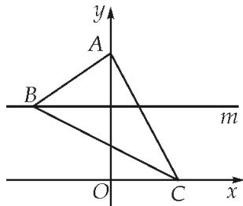
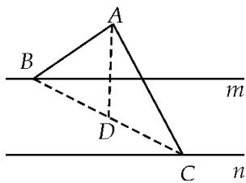

> [!faq]- 教师版例题解析
>
> > [!success]- **【答案】** 详见解析
>
> > [!note]- **【分析】**
> > 本题未单列分析。
>
> > [!note]- **【解析】**
> > 答案 $\frac{21}{4}$ 解析 坐标法 以直线 $n$ 为 $x$ 轴，过点 $A$ 且垂直于 $n$ 的直线为 $y$ 轴，建立如图所示的平面直角坐标系 $xOy$ ，如图：则 $A(0,3),C(c,0),B(b,2)$ ，则 $\overrightarrow{AB} = (b, - 1),\overrightarrow{AC} = (c, - 3)$ ，从而 $(b + c)^{2} + (-4)^{2}$ $= 5^{2}$ ，即 $(b + c)^{2} = 9$ ，又 $\overrightarrow{AC}\cdot \overrightarrow{AB} = bc + 3\leq \frac{(b + c)^{2}}{4} +3 = \frac{21}{4}$ ，当且仅当 $b = c$ 时，等号成立.
> > 
> > 极化恒等式 连接 BC，取 BC 的中点 D， $\overrightarrow{AB}\cdot\overrightarrow{AC}=AD^{2}-BD^{2}$ ，又 $AD=\frac{1}{2}\left|\overrightarrow{AB}+\overrightarrow{AC}\right|=\frac{5}{2}$ ，故 $\overrightarrow{AB}\cdot\overrightarrow{AC}=\frac{25}{4}-BD^{2}=\frac{25}{4}-\frac{1}{4}BC^{2}$ ，又因为 $BC_{min}=3-1=2$ ，所以 $(\overrightarrow{AB}\cdot\overrightarrow{AC})_{max}=\frac{21}{4}$ .
> > 
