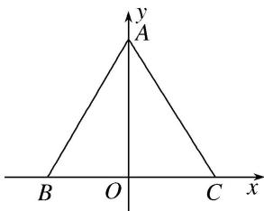
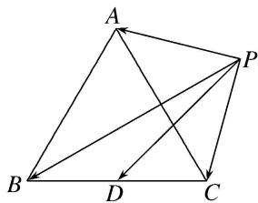
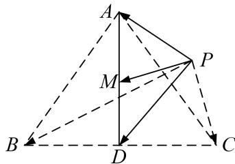

> [!faq]- 教师版例题解析
>
> > [!success]- **【答案】** B
>
> > [!note]- **【分析】**
> > 本题未单列分析。
>
> > [!note]- **【解析】**
> > 答案 B 解析 方法一 (解析法) 建立坐标系如图①所示, 则 $A, B, C$ 三点的坐标分别为 $A(0, \sqrt{3})$ , $B(-1, 0)$ , $C(1, 0)$ . 设 $P$ 点的坐标为 $(x, y)$ ,
> > 
> > 图①
> > 则 $\overrightarrow{PA} = (-x, \sqrt{3} - y)$ , $\overrightarrow{PB} = (-1 - x, -y)$ , $\overrightarrow{PC} = (1 - x, -y)$ , $\therefore \overrightarrow{PA} \cdot (\overrightarrow{PB} + \overrightarrow{PC}) = (-x, \sqrt{3} - y) \cdot (-2x, -2y) = 2(x^2 + y^2 - \sqrt{3}y) = 2\left[x^2 + \left(y - \frac{\sqrt{3}}{2}\right)^2 - \frac{3}{4}\right] \geqslant 2 \times \left(-\frac{3}{4}\right) = -\frac{3}{2}$ . 当且仅当 $x = 0$ , $y = \frac{\sqrt{3}}{2}$ 时, $\overrightarrow{PA} \cdot (\overrightarrow{PB} + \overrightarrow{PC})$ 取得最小值, 最小值为 $-\frac{3}{2}$ . 故选 B.
> > 方法二 （几何法） 如图②所示， $\vec{PB} + \vec{PC} = 2\vec{PD}$ (D 为 BC 的中点)，则 $\vec{PA} \cdot (\vec{PB} + \vec{PC}) = 2\vec{PA} \cdot \vec{PD}$ .
> > 
> > 图②
> > 要使 $\vec{PA} \cdot \vec{PD}$ 最小，则 $\vec{PA}$ 与 $\vec{PD}$ 方向相反，即点 $P$ 在线段 $AD$ 上，则 $(2\vec{PA} \cdot \vec{PD})_{\min} = -2|\vec{PA}||\vec{PD}|$ ，问题转化为求 $|\vec{PA}||\vec{PD}|$ 的最大值．又当点P在线段AD上时， $|\vec{PA}|+|\vec{PD}|=|\vec{AD}|=2\times\frac{\sqrt{3}}{2}=\sqrt{3},\therefore|\vec{PA}||\vec{PD}|\leqslant\left(\frac{|\vec{PA}|+|\vec{PD}|}{2}\right)^{2}=$ $=\left(\frac{\sqrt{3}}{2}\right)^{2}=\frac{3}{4},\quad\therefore[\vec{PA}\cdot(\vec{PB}+\vec{PC})]_{\min}=(2\vec{PA}\cdot\vec{PD})_{\min}=-2\times\frac{3}{4}=-\frac{3}{2}.$ 故选B.
> > 极化恒等式法 设 BC 的中点为 D, AD 的中点为 M, 连接 DP, PM, $\therefore \overrightarrow{PA} \cdot (\overrightarrow{PB} + \overrightarrow{PC}) = 2\overrightarrow{PD} \cdot \overrightarrow{PA} = 2|\overrightarrow{PM}|^{2} - \frac{1}{2} |\overrightarrow{AD}|^{2} = 2|\overrightarrow{PM}|^{2} - \frac{3}{2} \geq -\frac{3}{2}$ . 当且仅当 M 与 P 重合时取等号.
> > 
