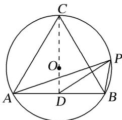

> [!faq]- 教师版例题解析
>
> > [!success]- **【答案】** 详见解析
>
> > [!note]- **【分析】**
> > 本题未单列分析。
>
> > [!note]- **【解析】**
> > 答案 $[-2, 6]$ 解析 取 $AB$ 的中点 $D$ ，连接 $CD$ ，因为三角形 $ABC$ 为正三角形，所以 $O$ 为三角形 $ABC$ 的重心， $O$ 在 $CD$ 上，且 $OC = 2OD = 2$ ，所以 $CD = 3$ ， $AB = 2\sqrt{3}$ 。又由极化恒等式得： $\overrightarrow{PA} \cdot \overrightarrow{PB} = |PD|^2 - \frac{1}{4}|AB|^2 = |PD|^2 - 3$ ，因为 $P$ 在圆 $O$ 上，所以当 $P$ 在点 $C$ 处时， $|PD|_{\max} = 3$ ，当 $P$ 在 $CO$ 的延长线与圆 $O$ 的交点处时， $|PD|_{\min} = 1$ ，所以 $\overrightarrow{PA} \cdot \overrightarrow{PB} \in [-2, 6]$ .
> > 
