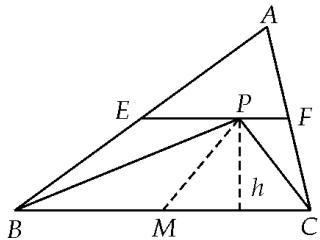

> [!faq]- 教师版例题解析
>
> > [!success]- **【答案】** 详见解析
>
> > [!note]- **【分析】**
> > 本题未单列分析。
>
> > [!note]- **【解析】**
> > 答案 $2\sqrt{3}$ 解析 取 $BC$ 的中点为 $D$ ，连接 $PD$ ，则由极化恒等式得 $\overrightarrow{PC} \cdot \overrightarrow{PB} + \overrightarrow{BC}^2 = \overrightarrow{PD}^2 - \frac{\overrightarrow{BC}^2}{4} + \overrightarrow{BC}^2 = \overrightarrow{PD}^2 + \frac{3\overrightarrow{BC}^2}{4} \geq \frac{\overrightarrow{AD}^2}{4} + \frac{3\overrightarrow{BC}^2}{4}$ ，此时当且仅当 $\overrightarrow{AD} \perp \overrightarrow{BC}$ 时取等号， $\overrightarrow{PC} \cdot \overrightarrow{PB} + \overrightarrow{BC}^2 \geq \frac{\overrightarrow{AD}^2}{4} + \frac{3\overrightarrow{BC}^2}{4} \geq 2\sqrt{\frac{\overrightarrow{AD}^2}{4} \cdot \frac{3\overrightarrow{BC}^2}{4}} = 2\sqrt{3}$ . 另解 取 $BC$ 边的中点 $M$ ，连接 $PM$ ，设点 $P$ 到 $BC$ 边的距离为 $h$ 。则 $S_{\triangle ABC} = \frac{1}{2} \cdot |\overrightarrow{BC}| \cdot 2h = 2 \Rightarrow |\overrightarrow{BC}| = \frac{2}{h}, PM \geq h$ ，所以 $\overrightarrow{PB} \cdot \overrightarrow{PC} + \overrightarrow{BC}^2 = \left[\overrightarrow{PM}^2 - \frac{1}{4}\overrightarrow{BC}^2\right] + \overrightarrow{BC}^2 = \overrightarrow{PM}^2 + \frac{3}{4}\overrightarrow{BC}^2 = \overrightarrow{PM}^2 + \frac{3}{h^2} \geq h^2 + \frac{3}{h^2} \geq 2\sqrt{3}$ (当且仅当 $|\overrightarrow{PM}| = h, h^2 = \sqrt{3}$ 时，等号成立)
> > 
