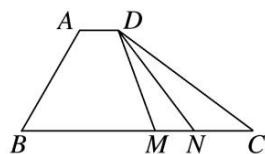

<!-- question-source:start -->
4. (2020·天津)如图, 在四边形 $ABCD$ 中, $\angle B = 60^{\circ}$ , $AB = 3$ , $BC = 6$ , 且 $\overrightarrow{AD} = \lambda \overrightarrow{BC}$ , $\overrightarrow{AD} \cdot \overrightarrow{AB} = -\frac{3}{2}$ , 则实数 $\lambda$ 的值为 , 若 $M$ , $N$ 是线段 $BC$ 上的动点, 且 $|\overrightarrow{MN}| = 1$ , 则 $\overrightarrow{DM} \cdot \overrightarrow{DN}$ 的最小值为 .

4.
<!-- question-source:end -->

![[高中/总复习/专题/平面向量/专题8 平面向量的极化恒等式-平面向量/考点二_平面向量数量积的最值_范围_问题/对点训练/题目/answers/Q00033449A1.md]]
