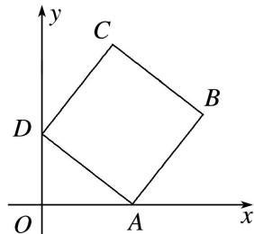

<!-- question-source:start -->
13. 在正方形 ABCD 中，AB=1，A，D 分别在 x，y 轴的非负半轴上滑动，则 $\overrightarrow{OC}\cdot\overrightarrow{OB}$ 的最大值为 \_\_\_\_.

13.
<!-- question-source:end -->

![[高中/总复习/专题/平面向量/专题8 平面向量的极化恒等式-平面向量/考点二_平面向量数量积的最值_范围_问题/对点训练/题目/answers/Q00033458A1.md]]
