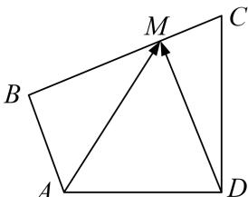

<!-- question-source:start -->
18. 如图，在平面四边形 $ABCD$ 中， $AB \perp BC$ ， $AD \perp CD$ ， $\angle BCD = 60^\circ$ ， $CB = CD = 2\sqrt{3}$ 。若点 $M$ 为边 $BC$ 上的动点，则 $\overrightarrow{AM} \cdot \overrightarrow{DM}$ 的最小值为 \_\_\_\_.

18.
<!-- question-source:end -->

![[高中/总复习/专题/平面向量/专题8 平面向量的极化恒等式-平面向量/考点二_平面向量数量积的最值_范围_问题/对点训练/题目/answers/Q00033463A1.md]]
