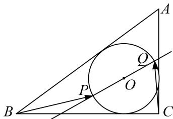

<!-- question-source:start -->
20. 如图, 圆 $O$ 为 Rt $\triangle ABC$ 的内切圆, 已知 $AC = 3$ , $BC = 4$ , $C = \frac{\pi}{2}$ , 过圆心 $O$ 的直线 $l$ 交圆于 $P$ , $Q$ 两点, 则 $\overrightarrow{BP} \cdot \overrightarrow{CQ}$ 的取值范围为 \_\_\_\_.

20.
<!-- question-source:end -->

![[高中/总复习/专题/平面向量/专题8 平面向量的极化恒等式-平面向量/考点二_平面向量数量积的最值_范围_问题/对点训练/题目/answers/Q00033465A1.md]]
