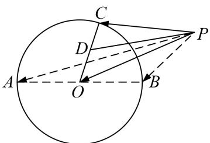

> [!faq]- 教师版对点训练解析
>
> > [!success]- **【答案】** C
>
> > [!note]- **【分析】**
> > 本题未单列分析。
>
> > [!note]- **【解析】**
> > 答案 C 解析 $\overrightarrow{PA} + \overrightarrow{PB} = 2\overrightarrow{PO}, \therefore (\overrightarrow{PA} + \overrightarrow{PB}) \cdot \overrightarrow{PC} = 2\overrightarrow{PO} \cdot \overrightarrow{PC}$ ，取 OC 中点 D，由极化恒等式得， $\overrightarrow{PO} \cdot \overrightarrow{PC} = |PD|^{2} - |CD|^{2} = |PD|^{2} - \frac{1}{4}$ ，又 $|PD|_{\min}^{2} = 0, \therefore (\overrightarrow{PA} + \overrightarrow{PB}) \cdot \overrightarrow{PC}$ 的最小值为 $-\frac{1}{2}$ .
> > 
