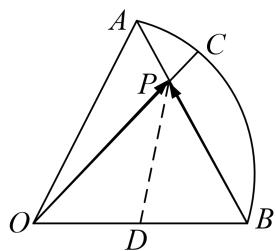

> [!faq]- 教师版对点训练解析
>
> > [!success]- **【答案】** 详见解析
>
> > [!note]- **【分析】**
> > 本题未单列分析。
>
> > [!note]- **【解析】**
> > 答案 $-\frac{1}{16}$ 解析 取 $OB$ 的中点 $D$ ，连接 $PD$ ，则 $\overrightarrow{OP} \cdot \overrightarrow{BP} = |\overrightarrow{PD}|^2 - |\overrightarrow{OD}|^2 = |\overrightarrow{PD}|^2 - \frac{1}{4}$ ，于是只要求求 $PD$ 的最小值即可，由图可知，当 $PD \perp AB$ ，时， $PD = \frac{\sqrt{3}}{4}$ ，即所求最小值为 $-\frac{1}{16}$ .
> > 
