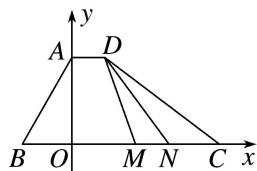
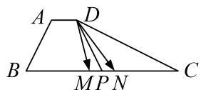

> [!faq]- 教师版对点训练解析
>
> > [!success]- **【答案】** 详见解析
>
> > [!note]- **【分析】**
> > 本题未单列分析。
>
> > [!note]- **【解析】**
> > 答案 $\frac{1}{6} \frac{13}{2}$ 解析 第 1 空 因为 $\overrightarrow{AD} = \lambda \overrightarrow{BC}$ , 所以 $AD \parallel BC$ , 则 $\angle BAD = 120^{\circ}$ , 所以 $\overrightarrow{AD} \cdot \overrightarrow{AB} = |\overrightarrow{AD}| \cdot |\overrightarrow{AB}| \cdot \cos 120^{\circ} = -\frac{3}{2}$ , 解得 $|\overrightarrow{AD}| = 1$ . 因为 $\overrightarrow{AD}$ , $\overrightarrow{BC}$ 同向, 且 $BC = 6$ , 所以 $\overrightarrow{AD} = \frac{1}{6} \overrightarrow{BC}$ , 即 $\lambda = \frac{1}{6}$ .
> > 第2空 通法 在四边形ABCD中，作 $AO \perp BC$ 于点O，则 $BO = AB \cdot \cos 60^{\circ} = \frac{3}{2}, AO = AB \cdot \sin 60^{\circ} = \frac{3\sqrt{3}}{2}$ . 以O为坐标原点，以BC和AO所在直线分别为x，y轴建立平面直角坐标系．如图，设 $M(a,0)$ ，不妨设点N在点M右侧，
> > 
> > 则 $N(a+1,0)$ ，且 $-\frac{3}{2}\leq a\leq\frac{7}{2}$ 。又 $D\left(1,\frac{3\sqrt{3}}{2}\right)$ ，所以 $\overrightarrow{DM}=\left(a-1,-\frac{3\sqrt{3}}{2}\right)$ ， $\overrightarrow{DN}=\left(a,-\frac{3\sqrt{3}}{2}\right)$ ，所以 $\overrightarrow{DM}\cdot\overrightarrow{DN}=a^{2}-a+\frac{27}{4}=\left(a-\frac{1}{2}\right)^{2}+\frac{13}{2}$ 。所以当 $a=\frac{1}{2}$ 时， $\overrightarrow{DM}\cdot\overrightarrow{DN}$ 取得最小值 $\frac{13}{2}$ 。
> > 极化恒等式法 如图，取 MN 的中点 P，连接 PD，则 $\overrightarrow{DM}\cdot\overrightarrow{DN}=\overrightarrow{PD}^{2}-\overrightarrow{MP}^{2}=\overrightarrow{PD}^{2}-\frac{1}{4}$ ，当 $\overrightarrow{PD}\perp\overrightarrow{BC}$ 时， $|\overrightarrow{PD}|^{2}$ 取最小值 $\frac{27}{4}$ ，所以 $\overrightarrow{DM}\cdot\overrightarrow{DN}$ 的最小值为 $\frac{13}{2}$ .
> > 
