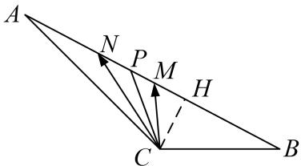

> [!faq]- 教师版对点训练解析
>
> > [!success]- **【答案】** 详见解析
>
> > [!note]- **【分析】**
> > 本题未单列分析。
>
> > [!note]- **【解析】**
> > 答案 $\frac{1 - 3\sqrt{5}}{8}$ 解析 取 $MN$ 的中点 $P$ ，则由极化恒等式得 $\overrightarrow{CM} \cdot \overrightarrow{CN} = \left|\overrightarrow{CP}\right|^2 - \frac{1}{4}\left|\overrightarrow{MN}\right|^2 = \left|\overrightarrow{CP}\right|^2 - \frac{1}{4}$ ， $\because \overrightarrow{CM} \cdot \overrightarrow{CN}$ 的最小值为 $\frac{3}{4}$ ， $\therefore \left|\overrightarrow{CP}\right|_{\min} = 1$ ，由平几知识知：当 $CP \perp AB$ 时， $CP$ 最小，如图，作 $CH \perp AB$ ， $H$ 为垂足，则 $CH = 1$ ，又 $AC = 2BC = 4$ ，所以 $\angle B = 30^\circ$ ， $\sin A = \frac{1}{4}$ ，所以 $\cos \angle ACB = \cos (150^\circ - A) = \frac{1 - 3\sqrt{5}}{8}$ .
> > 
