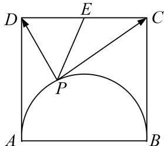

> [!faq]- 教师版对点训练解析
>
> > [!success]- **【答案】** 详见解析
>
> > [!note]- **【分析】**
> > 本题未单列分析。
>
> > [!note]- **【解析】**
> > 答案 [0, 16] 解析 如图取 $CD$ 的中点 $E$ , 连接 $PE$ , $\overrightarrow{PC} \cdot \overrightarrow{PD} = \overrightarrow{PE}^2 - \overrightarrow{DE}^2 = \overrightarrow{OE}^2 - 2$ , $2 \leqslant |\overrightarrow{PE}| \leqslant 2\sqrt{5}$ ,
> > 所以 $\overrightarrow{PC}\cdot\overrightarrow{PD}$ 的取值范围为[0, 16].
> > 
