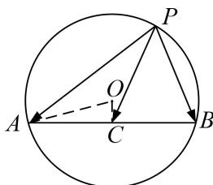

> [!faq]- 教师版对点训练解析
>
> > [!success]- **【答案】** 详见解析
>
> > [!note]- **【分析】**
> > 本题未单列分析。
>
> > [!note]- **【解析】**
> > 答案 [-6, 10] 解析 极化恒等式法 设 AB 的中点为 C，连接 CP，则 $\overrightarrow{PA} \cdot \overrightarrow{PB} = |\overrightarrow{PC}|^{2} - |\overrightarrow{AC}|^{2} = |\overrightarrow{PC}|^{2} - 15$ . $|\overrightarrow{PC}|^{2} - 15 \geqslant 25 - 15 = 10$ , $|\overrightarrow{PC}|^{2} - 15 \leq 9 - 15 = -6$ .
> > 
