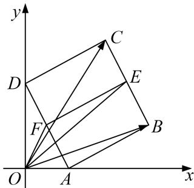

> [!faq]- 教师版对点训练解析
>
> > [!success]- **【答案】** 详见解析
>
> > [!note]- **【分析】**
> > 本题未单列分析。
>
> > [!note]- **【解析】**
> > 答案 2 解析 如图取 $BC$ 的中点 $E$ , 取 $AD$ 的中点 $F$ , $\overrightarrow{OC} \cdot \overrightarrow{OB} = \overrightarrow{OE}^2 - \overrightarrow{BE}^2 = \overrightarrow{OE}^2 - \frac{1}{4}$ , 而 $|\overrightarrow{OE}| \leqslant |\overrightarrow{OF}| + |\overrightarrow{FE}| = \frac{1}{2} ||\overrightarrow{AD}| + |\overrightarrow{FE}|| = \frac{1}{2} + 1 = \frac{3}{2}$ , 当且仅当 $O, F, E$ 三点共线时取等号., 所以 $\overrightarrow{OC} \cdot \overrightarrow{OB}$ 的最大值为 2.
> > 
