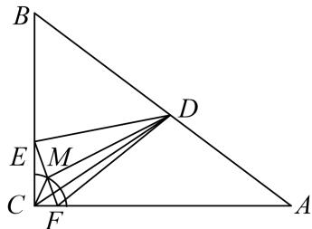

> [!faq]- 教师版对点训练解析
>
> > [!success]- **【答案】** 详见解析
>
> > [!note]- **【分析】**
> > 本题未单列分析。
>
> > [!note]- **【解析】**
> > 答案 $\frac{15}{4}$ 解析 设 $EF$ 的中点为 $M$ , 连接 $CM$ , 则 $|\overrightarrow{CM}| = \frac{1}{2}$ , 即点 $M$ 在如图所示的圆弧上, 则 $\overrightarrow{DE} \cdot \overrightarrow{DF} = |\overrightarrow{DM}|^2 - |\overrightarrow{EM}|^2 = |\overrightarrow{DM}|^2 - \frac{1}{4} \geqslant ||CD| - \frac{1}{2}|^2 - \frac{1}{4} = \frac{15}{4}$ .
> > 
