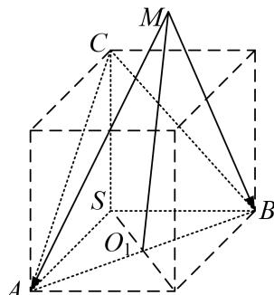

> [!faq]- 教师版对点训练解析
>
> > [!success]- **【答案】** 详见解析
>
> > [!note]- **【分析】**
> > 本题未单列分析。
>
> > [!note]- **【解析】**
> > 答案 $2\sqrt{3} + 2$ 解析 如图， $\overrightarrow{MA} \cdot \overrightarrow{MB} = \overrightarrow{MO_1^2} - 2$ 。当 $M, A, B$ 在同一个大圆上且 $MO_1 \perp AB$ ，点 $M$ 与线段 $AB$ 在球心的异侧时， $|\overrightarrow{MO_1}|$ 最大，又 $2R = \sqrt{2^2 + 2^2 + 2^2} = 2\sqrt{3}$ ，所以 $R = \sqrt{3}$ 。 $|\overrightarrow{MO_1}|_{max} = \sqrt{3} + 1$ ， $|\overrightarrow{MO_1^2} - 2$ 的最大值为 $2\sqrt{3} + 2$ 。
> > 
